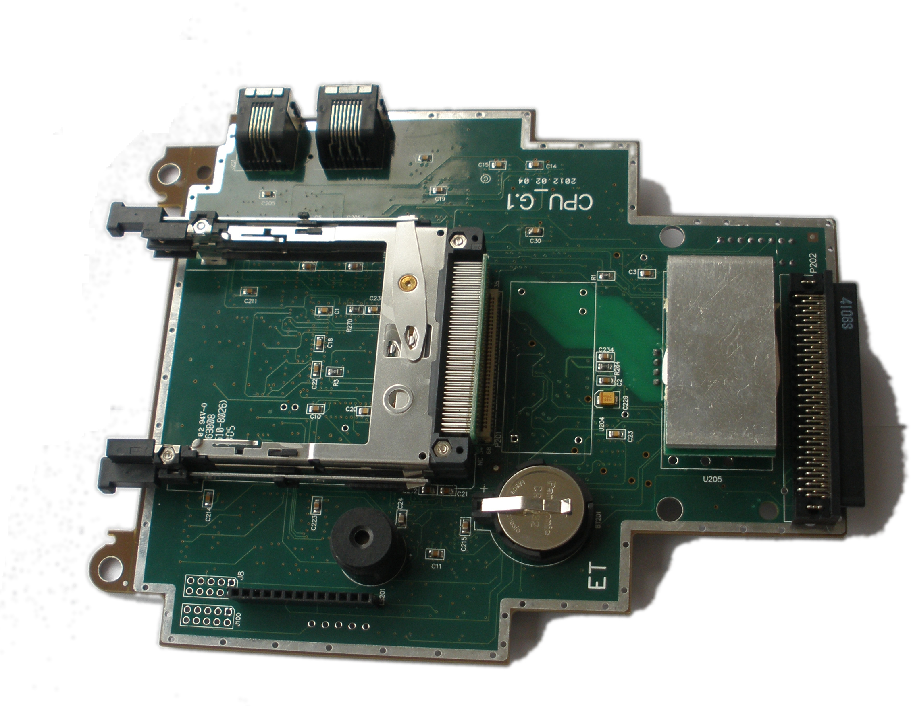
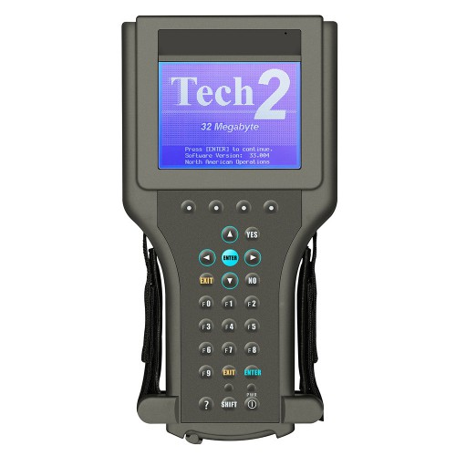
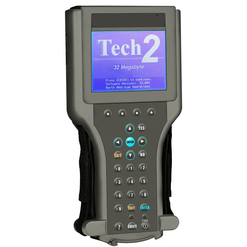
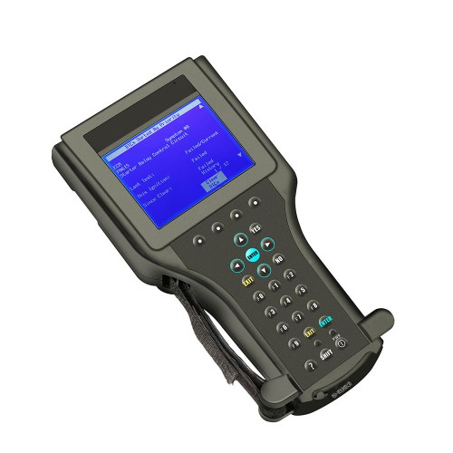
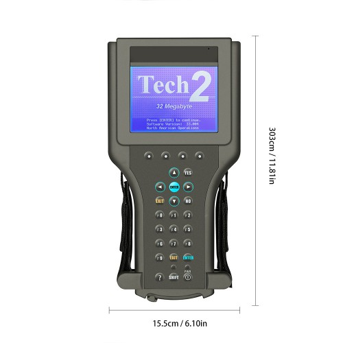

# Tech 2 media archive

## Tech 2 related videos on YouTube

<iframe src="http://www.youtube.com/embed/l1YeT9a9ZOo" frameborder="0" allowfullscreen></iframe>
GM Tech 2 Training video 1996

<iframe src="http://www.youtube.com/embed/k6UI55ZNqeo" frameborder="0" allowfullscreen></iframe>
How to Install Chevrolet European GlobalTIS

## Tech 2 related documents

[BBA-Reman - How to determine if a Tech2 Handset is a clone](bba-reman_how_to_detect_clone_tech2.pdf)

[GM - Tech2 UserGuide](gm_tech2_user_guide.pdf)

[GM - TIS2WEB Error codes and solutions](gm_tis2web_error_codes_and_solutions.pdf)

[Vetronix - Tech 2 User's guide](vetronix_tech2_users_guide.pdf)

## Tech 2 related weblinks

[Saab Central: Guide to installing TIS2000 on any computer](http://www.saabcentral.com/forums/showthread.php?t=309402)

[AVTOTOOLS.COM: TIS2000 installation documentation](https://www.avtotools.com/pd_info/tis2000/)

[UKSaab: TIS2Web / TIS2000 Software Installation](http://www.uksaabs.co.uk/UKS/viewtopic.php?f=2&t=123074)

[How to use Ricoh Memory Card Explorer software](http://www.synchrotech.com/support/mce_copy_files_to_linear-flash_sram.html)

[UKSaabs: 900/9000 card](http://www.uksaabs.co.uk/UKS/viewtopic.php?f=2&t=116692)

[Russian blog: Repair/enhance the Tech 2 ](http://diy-tech2.blogspot.com)

[WOBD2.COM: GM Tech2 User Guide](http://www.wobd2.com/wholesale/gm-tech2.html)

## The Tech 2 Image gallery

## Overview

---

## 3D rendering

---

