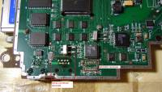
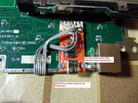

# USB modification

Found on the [TrionicTuning.com](http://trionictuning.com) a modification by JohnJocke:

Chinese Tech2 devices seem to have lots of problems with the serial connection. First of all it is not easy to find a working USB-serial adapter for a modern laptop with no native serial ports but also the actual serial transceiver chips in the chinese Tech2 devices are prone to fail. Serial transceiver chips in some Tech2 devices lasted only for a few days or were not working at all.

The failing chip is usually the MAX202 (or MAX232 on some devices) which translates TTL level serial signals into proper RS-232 signal. This chip is connected to the UART interface chip ST16C1550.

Almost all of USB to RS-232 adapters translate signals back to TTL and then they are sent over USB device. It is possible to bypass TTL ↔ RS-232 translations by directly connecting USB-Serial adapter. There are plenty of them available and the ones with FTDI chip have proven to work with Tech2.

## Connecting the USB to UART

The procedure to connect a USB to UART module in the Tech2 requires that you remove the existing serial transceiver chip (MAX202/MAX232) completely. Then you need to attach the USB to UART module to the mainboard and solder some wires to correct pads in the mainboard. You might also want to remove the original serial connector (RJ45) to make some room for the USB to UART module.

And there you go, a Tech2 with USB connection! Total price of the mod: ~5$.

The module also seems to perform much better than the original RS232 connection. The original RS232 connection seemed to have reliability issues with higher baud rates but the USB-UART module works perfectly even with the highest baud rate (115200)!

## Serial connector removed

{:target="\_blank"}

## Connecting wires for the USB-UART

{:target="\_blank"}

## Connect RTS to CTS on the USB-UART module

{:target="\_blank"}

## Cutting the +v pin on the USB connector

{:target="\_blank"}

## Mounted the UART module to the Tech2 PCB

{:target="\_blank"}

## Side view of the completed modification

{:target="\_blank"}
