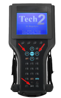

# Switching between cards

Tech2 contains two PCMCIA slots for memory cards, only one of them can be active.

Current card can be switched using key combination on title screen:

- `Shift` → `Left`
- `Shift` → `Right`.

This means press and release `Shift`, then press and release `Left` or `Right`.

Not the usual meaning of `Shift`-something, where you press `Shift` and hold it while pressing the other button.

You may have to push and release `Shift` again after switching, as the light may stay on, affecting further inputs.

