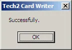

# Writing PCMCIA using Card Writer

The Tech2 Card Writer is an easy to use, yet relatively slow processing, application which allows to write linear flash PCMCIA cards using the RS-232 connection on the Tech2 device. This application is written by AlexRE from [AlexRE.RU](http://www.alexre.ru/?item=3tech2) in 2011.

## Requirements

*   Tech2
*   12V DC adapter as power source for the Tech2
*   PCMCIA card inserted to Tech2
*   COM port, this can be a physical DB9 or a USB to Serial cable, on a desktop/laptop computer.
*   Microsoft Windows
*   [Tech2 Card Writer](/assets/tools/alexre_cardwriter.zip) from [AlexRE.RU](http://alexre.ru/galery/upload/%D0%A4%D0%B0%D0%B9%D0%BB%D1%8B/Tech2/cardwriter.zip).
*   [PCMCIA card bin files](/content/tech2_pcmcia/available_.bin-files/) for Tech2

## Preparations

Download Tech2 Card Writer and the binary file you wish to write to the PCMCIA card.
Writing a PCMCIA card

Make sure that your Tech2 is connected to a reliable power source.

Connect your Tech2 with a serial cable to a serial port on your computer.

## Writing the card

Start `Card_writer.exe`

Select the designated COM port which connects to the Tech2.

Select the binary file you wish to write to the PCMCIA card insterted into the Tech2.

Power up the Tech2 and wait for it to boot to the welcome screen before you click Open.

_Note:_ Starting this operation overwrites the content of the PCMCIA card!

Start the process and wait for several minutes to complete the clearance of the flash memory.

The Tech2 display will now show a similar screen:

The writing process takes around 15 minutes for a 32MB card.

After processing the .BIN file from your computer to the Tech2 the Tech2 Card Writer software will report the status.

 