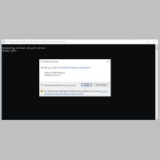

# Tech2win v2.302

Application information

---

| Name           | Function                                          |
| -------------- | ------------------------------------------------- |
| Install        | `C:\Program files (x86)\General Motors\Tech2Win\` |
| Userdata       | `C:\Users\Public\General Motors\Tech2Win\`        |
| Configurations | `C:\Users\Public\General Motors\Tech2Win\config`  |
| .bin files     | `C:\Users\Public\General Motors\Tech2Win\pcmcia`  |
| Appdata        | `C:\ProgramData\General Motors\Tech2Win\`         |

---

This software is limited to the following TIS Downloads;

- Chevrolet YGM
- China 1
- China 2
- Daewoo
- GM Brasil
- GM South Africa
- Holden
- Holden Export
- Isuzu
- North American Operations
- Opel GT/Chevrolet HHR
- Opel/Vauxhall
- Saturn Astra

## Requirements

### Operation system

Minimal: Windows XP / 7, 32-bit

Tested: Windows 10 20H2 (OS Buils 19042.631), 64-bit

### Prerequisite software

### Installation software

| Name     | Author | Type | Version | Date         | Revision                               | MD5 hash                         |
| -------- | ------ | ---- | ------- | ------------ | -------------------------------------- | -------------------------------- |
| Tech2Win | GM     | MSI  | v2.302  | 2014-SEPT-04 | {AB598C10-FBC7-413F-8041-6FD65AA61301} | 4f9c16b8c43ce88ffd118454772d9f28 |

## Installation

### Step 1

{:target="\_blank"}

Run the `Tech2Win v2.302.msi` and choose `Next` to continue.

---

### Step 2

{:target="\_blank"}

Read the license agreement carefully, select `I accept the terms in the License Agreement` and click `Next`.

---

### Step 3

{:target="\_blank"}

If you like you can alter the installation destination and click `Next`.

---

### Step 4

{:target="\_blank"}

Ready to install? Click `Next`.

---

### Step 5

{:target="\_blank"}

When the "User Account Control"-functionality is enabled; click `Yes`.

---

### Step 6

{:target="\_blank"}

Install the virtual com port driver from ELTIMA software by hitting `Install`

---

### Step 7

{:target="\_blank"}

Completed the Tech2Win setup wizard.
