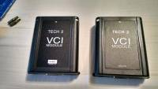
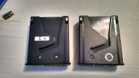
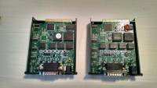
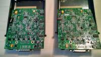

# VDI module malfunctioning
 Some Tech 2 devices may fail by randomly not connecting to the vehicle. The Tech 2 would display `No communications with vehicle` `Check Diagnostic Link Connector`. This could be a sign of a malfunctioning VCI module.

It appears that not all VCI modules are manufactured on the same quality level. 

This Tech 2 has a faulty VCI module. 

While running a self test a similar result may appear.

## VDI modules differences

It appears that two different VCI modules are manufactured and sold.

*   One is known for having similar issues that I was experiencing.
    *   No QC stamp.
*   The other seems to be built much better, with far better solder quality, slightly different markings on the board, and some different components.
    *   QC stamp visible

## Side-by-side comparison

The good module is depicted as the left module.

Note the good VCI has the QCI number stamped on the top of the case.

Note the bad VCI has the bed jumper wires on the chip, among the lower quality solder joints

Note these components are also give-a-ways to see the better manufactured board.

Aside from this the OBD connector may also be the root cause of communication malfunctioning.

## Be careful when purchasing

Just a warning, be careful when you purchase these. In my experience, even though the seller offered a 3 year warranty, once the item was paid for, and the transaction completed, he did not respond to messages through email or even through the purchasing site. I had to purchase the new VCI if I wanted my Tech 2 to work, so I went with another vendor, and looked for one that had the markings I showed above. I can't guarantee that if you order the “qc” model VCI that you will get the higher quality one, only that this worked for me.

Thank the [SaabCentral.com](http://www.saabcentral.com) for being the source information.
