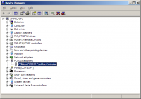
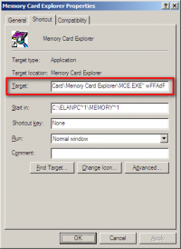
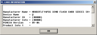

# Writing PCMCIA using MCE

The Memory Card Explorer, in short MCE, is a versatile application which allows to read and write linear flash PCMCIA cards. Reading and writing cards using the internal PCMCIA slot is relatively fast as writing, including verify, a 32MB card takes around 5 minutes. This article covers version 3.16, designed for Microsoft's Windows NT4.0/2000/XP (32-bit only). This software has been designed by Elan Digital Systems Ltd. and released August 2002, currently archived on the [Synchrotech Support Blog](http://synchrotech.blogspot.com/2013/04/elan-downloads-and-support-archive.html).

## Requirements

Required hardware: 
*   [Supported PCMCIA slot](/content/tech_2_pcmcia/writing_pcmcia_cards/writing_pcmcia_hardware_compatibility.html) in a physical desktop/laptop computer.

Required software:
*   Microsoft Windows
*   Elan Memory Card Explorer v3.16

Assuming that the application has been installed in the default folder: C:\ElanPCCard\Memory Card Explorer

## Discovering the PCMCIA memory resource

As this application isn't aware of the plug-and-play functionality the MCE needs to be instructed to handle the PCMCIA slot on a particular memory address. This address can be found in the system configuration of Microsoft Windows XP. Please note that your particular PCMCIA adapter can be allocating a different memory page.

Click on `Start` → `Run` and type the following command:

`devmgmt.msc` and press `enter`

Look for PCMCIA adapters and you may find for example `O2Micro OZ6912 Cardbus Controller`.

Double click on the defined controller and navigate the `Resources` tab.

The Memory Range resource settings, for example `FFAFF000-FFAFFFFF` need to be noted as this is the start address of the controller. This is needed to tell the MCE application to find the PCMCIA card.

For this particular PCMCIA adapter the memory starts at `FFAFF000-FFAFFFFF`

Formule: Eg: if the PCMCIA socket has a memory resource of `FFAFF000` then use this as a parameter to the MCE application.

Take the first four hexadecimals of the memory address: `FFAF` and add a `w` as a prefix and insert a `d` just before the last hexadecimal value, so this will combine into `wFFAdF`.

The command line, as an end result, will be like:

`"C:\ElanPCCARD\Memory Card Explorer\MCE.EXE" wFFAdF`

## Starting the Memory Card Explorer

Copy the above mentioned command into the shortcut created by the installer or create a new shortcut on your desktop.

Start the application using this shortcut.

Click 'OK' on the splash screen and wait for the PC-Card services to register.

Now the MCE will start and show the detected card which is inserted in the PCMCIA slot.

To make sure that your PCMCIA card and the slot has been detected click on the i icon at the top of the main interface.

Now the application is ready for reading, verifying and writing your linear flash card.
