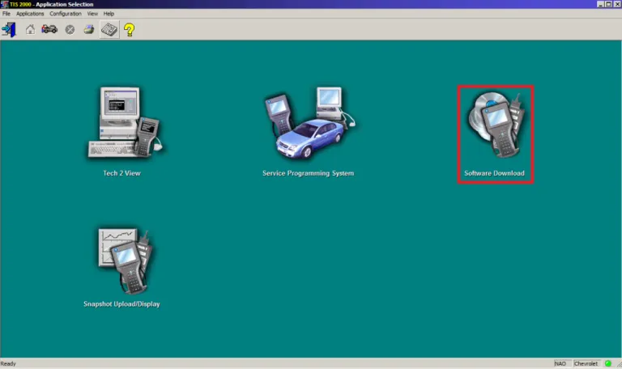
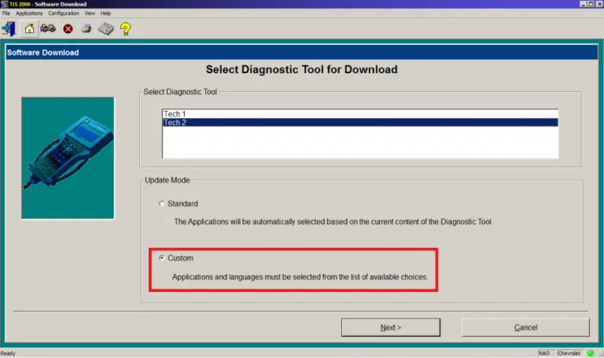
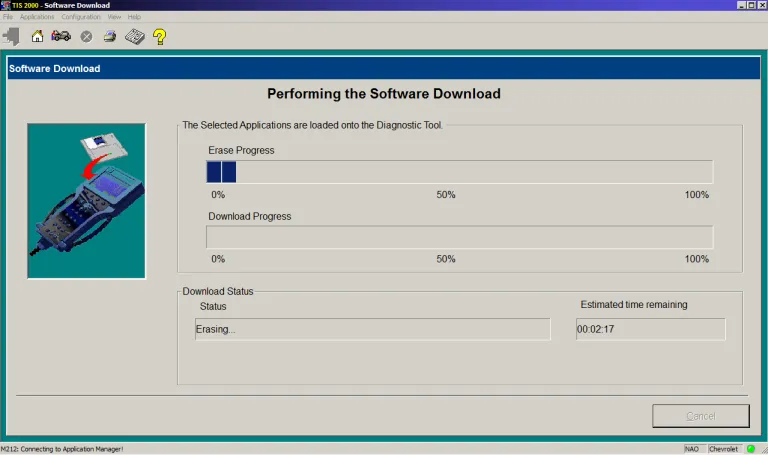
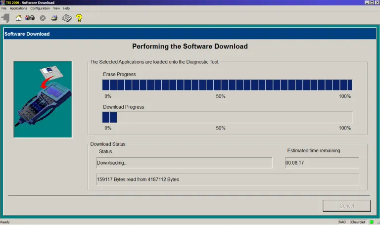

# Writing PCMCIA using TIS2000

TIS2000 is a computer-based system used for reprogramming software as well as troubleshouting and diagnostics on vehicle control units. The system requires a hand-held, programmable diagnostic tool, Tech 2, in order to communicate with the vehicle.

Source: [SAAB WIS Online](https://saabwisonline.com/c3/9-5/2000/0-general/tis-2000/technical-description-tis-2000/tis-2000-technical-information-system-2000/)

TIS2000 can be used to download new software to your PCMCIA card used in the Tech 2, the process takes around 15 minutes for a 32MB card.

## Requirements

*   Tech 2
*   12V DC adapter as power source for the Tech 2
*   PCMCIA card inserted to Tech 2
*   COM port, this can be a physical DB9 or a USB to Serial cable, on a desktop/laptop computer.
*   Microsoft Windows
*   TIS2000

## Preparations

Install TIS2000 and make sure that your Tech 2 can communicate with your computer.
Writing a PCMCIA card

Make sure that your Tech 2 is connected to a reliable power source.

Connect your Tech 2 with a serial cable to a serial port on your computer.

Power up the Tech 2 and wait for it to boot to the welcome screen.

Start TIS2000.

On the start screen of TIS2000, click on `Software Download`.

__Note:__ The start screen of TIS2000 may look different depending on the version you are running.

In the next step you will be prompted to select the diagnostic tool and update mode you want to use. For update mode you have two options to choose between;

*   Standard
    *   TIS2000 will check the current software on your PCMCIA card and then download the latest version, if any newer version is available.
*   Custom
    *    Enables to select the version you want and also the language.

Select `Custom` and press `Next`.

Now you will see the software versions available in your installed version of TIS2000. To see the available languages, expand (+) the folder of a software version.

Mark the software version and language you wish to write to your PCMCIA card and then press `Select`. The software version you have chosen will now be displayed on the right side of the Software Download window. When the selected version and language is the one you wish to write to the PCMCIA card, press `Download >`.

TIS2000 will establish communication with Tech 2 and read the content of the PCMCIA card inserted to it.

TIS2000 will now start to erase the content on the PCMCIA card.

During the process the Tech 2 will show the following screen:

When the erasing process is finished, TIS2000 will start to download/write the new software to the PCMCIA card.

When the downloading/writing process is finished you will see the following screen:

The new software is now written to your PCMCIA card. Click `Close` and disconnect the Tech 2 from your computer.