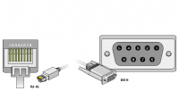

# Connecting to Techline

The Tech2 can be connected to a computer using the serial (RS-232) connector on your computer. Most modern machines don't have that built-in serial device anymore. In this case you can opt for RS-232 comport add-on card, which could be hard to find. Another alternative would be installing a USB-to-serial adapter cable. Please note that not all USB-to-serial cables work with the Tech2, see: [USB to serial hardware compatibility list](/content/tech_2_hardware_issues/usb_to_serial_adapters.html).

An external power supply has to be used only when the Tech2 isn't connected and powered via OBD-2. The power supply should only be connected directly to the Tech2 when there is no connection to the car, otherwise the power should be connected closest to the car diagnose connection. This is to make the bus communication stable as possible.

## Specification

The Tech2 communicates using the following protocol properties.

| Tech2 RS-232 | Setting |
| --- | --- |
| Standard | RS-232 |
| Speed | 115200 bit/s |
| Data bits | 8 bits |
| Parity | not set |
| Stop bits | 1 |
| Flow control | no |

 ## External power supply

| Power supply | Setting |
| --- | --- |
| Voltage | 12 V |
| Current | 1,5-3,0 A (battery cable is fused on 3,0 A) |
| Polarity | (+) center |
| Plug | Ø2,5×5,5 mm |

## Wiring diagram

Standard DB9 female connector to RJ45 male connector, or DB9 female to RJ45 female adapter with RJ45 TP Ethernet cable.

Internal wire colours refers to most adapters and moulded cables, but doesn't apply to RJ45 TP Ethernet cables.

The male RJ45 is numbered 8-1 when the lock tab is facing down.

The DB9 connector is marked 1 and 9 at the terminal surface.

The pin out in this image shows the RJ45 female and DB9 female numbers.

| Tech2 RS-232 | Setting |
| --- | --- | 
| Standard | RS-232 |

## Serial cable pin out

DB9 female to RJ45 male

| DB9 | RJ45 | Colour |
| --- | --- | --- |
| 1 | 2 | Orange |
| 2 | 4 | Red |
| 3 | 5 | Green |
| 4 | 8 | White |
| 5 | 7 | Brown |
| 6 | 1 | Blue |
| 7 | 3 | Black |
| 8 | 6 | Yellow |
| 9 | NC | n/a |

--- 

## Serial adapter pin out

DB9 female to RJ45 female

| DB9 |	RJ45 | Colour |
| --- | --- | --- |
| 1 | 7 | Orange |
| 2 | 5 | Red |
| 3 | 4 | Green |
| 4 | 1 | White |
| 5 | 2 | Brown |
| 6 | 8 | Blue |
| 7 | 6 | Black |
| 8 | 3 | Yellow |
| 9 | NC | n/a |

---

## Testing communication

In order to check the communication between de computer and the Tech2 the first thing to check is the RS-232 functionality on the Tech2 device. The Tech2 uses the RJ45 connector for the RS-232 serial out. The RS-232 functionality can be checked by using a special RJ45/RS-232 loop back plug.

## RJ45 Serial self test pin out

| Terminal | Loopback terminal |
| --- | --- |
| 1 | 3 |
| 2 | 7 |
| 4 | 5 |
| 6 | 8 |

---

## Diagnosing serial connection

First make sure that the [serial Loopback is working](/content/tech_2_hardware_issues/rs232_loopback.html).

As the loop back functionality has passed then move to the next link in the chain.
USB to serial converter

First figure out which COM port the Tech2 is connected to.

Download the [PuTTY](http://the.earth.li/~sgtatham/putty/latest/x86/putty.exe) program which allows you to eavesdrop on the Tech2 device.
